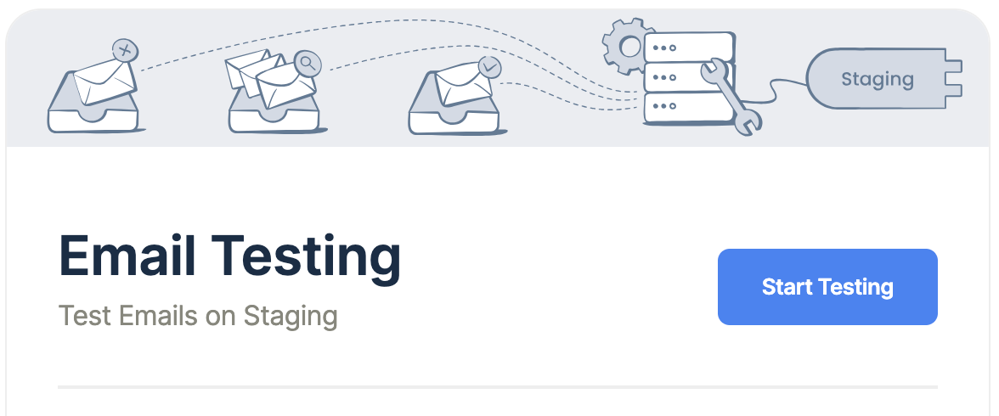
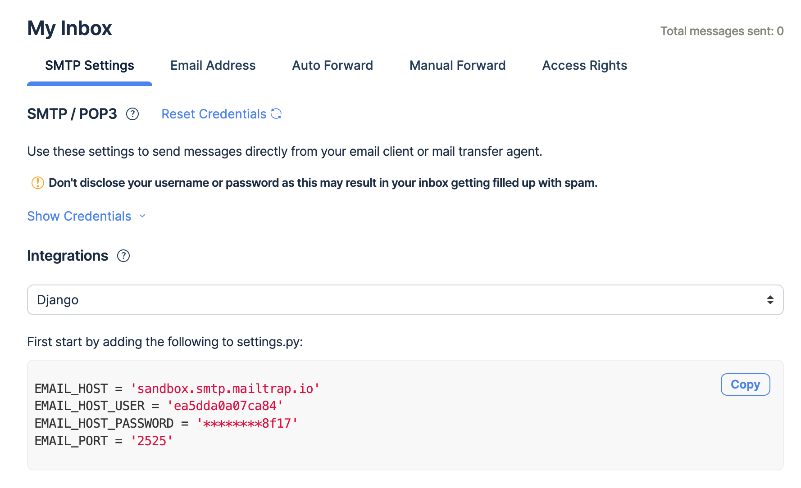
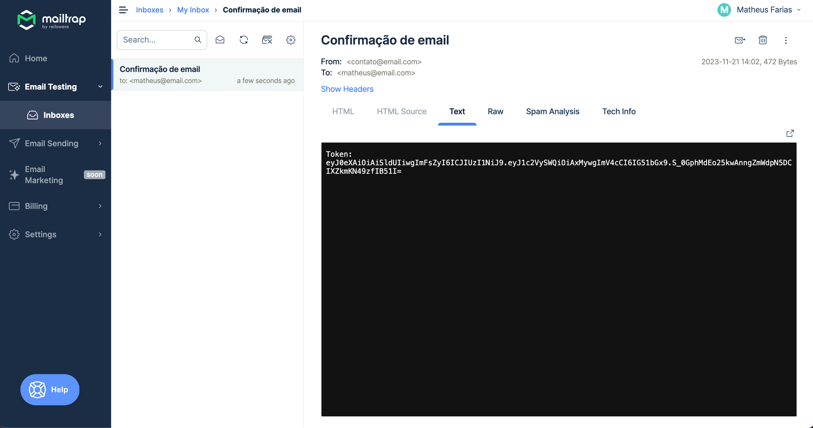

# Desafio Capyba

Desafio de API RESTful da Capyba

## Como rodar o projeto local:

1. Clone o repositório e acesse o mesmo pelo terminal.
```console
git clone git@github.com:matheusfs99/desafio-capyba.git
cd dojo_recife_api
```

2. Crie um virtualenv com Python 3.11
```console
python -m venv venv
```
3. Ative o virtualenv. 
 - Unix:
```console
source venv/bin/activate
```
 - Windows:
```console
venv/Scripts/activate
```
4. Instale as dependências.
```console
pip install -r requirements.txt
```
5. Configure a instância com o .env
```console
cp .env-example .env
```
6. Execute os testes.
```console
pytest
```

### Extra:
 - Gere uma SECRET_KEY executando o comando:
    ```console
   python utils/secret_gen.py
   ```
   e insira essa secret_key no seu .env

## Para configurar o envio de email, siga os seguintes passos:

1. Faça login ou cadastre-se no site https://mailtrap.io/signin
2. Na página inicial, clique em Start Testing
3. Em  My Inbox, na aba SMTP Settings, selecione a integração com Django
4. Copie as credenciais clicando em "copy" e cole no .env do projeto sem as aspas e sem espaços entre a variável, o simbolo de atribuição(=) e o valor corrspondente
5. Faça o teste executando o endpoint de envio de email
6. O email chegará no inbox do mailtrap

## Requisições no Insomnia
[](https://insomnia.rest/run/?label=Desafio%20Capyba&uri=https%3A%2F%2Fraw.githubusercontent.com%2Fmatheusfs99%2Fdesafio-capyba%2Fmain%2Fdoc_files%2FInsomnia_Desafio_Capyba.json%3Ftoken%3DGHSAT0AAAAAACKDQ2H77D24JL6LPQ35KTTCZK4XL7Q)

## Acesso admin
O admin do django está habilitado. Para acessá-lo, rode o seguinte comando:
```console
python manage.py createsuperuser
```
e preencha os dados solicitados para criação de um super usuário.

A url para acessar o admin é http://localhost:8000/admin
